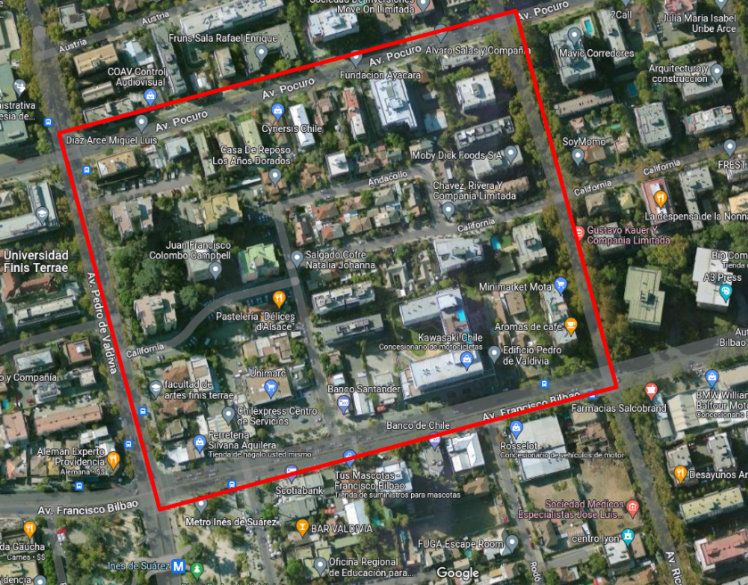
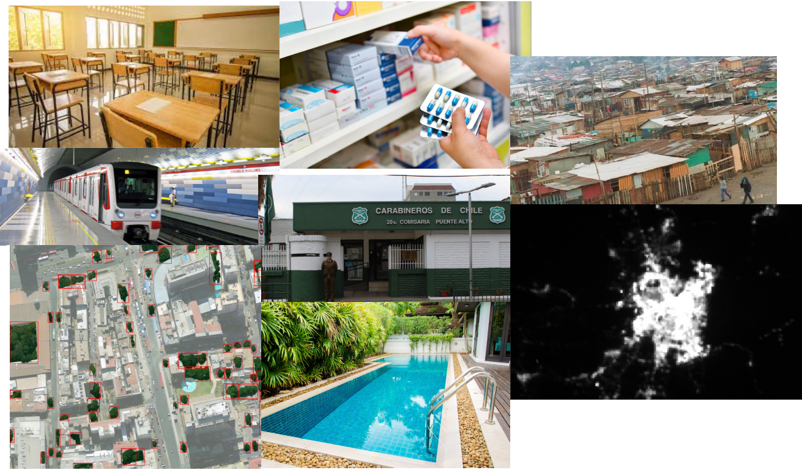
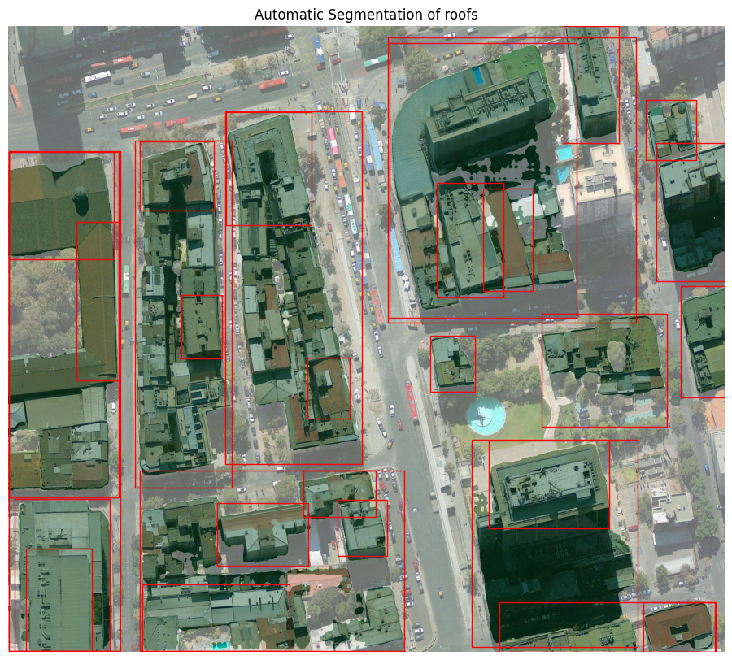

class: center, middle

.linea-superior[]
.linea-inferior[]


## Data Science Accelerator Program

### Socioeconomic stratification of the sampling frame of dwellings through the use of satellite images

#### June 8, 2023


```{r setup, include=FALSE}
options(htmltools.dir.version = TRUE)
knitr::opts_chunk$set(message = FALSE, echo = FALSE) 
```

```{r xaringan-themer, include=FALSE, warning=FALSE}
library(xaringanthemer)
```

---

background-image: url("imagenes/fondo2.PNG")
background-size: contain;
background-position: 100% 0%

# Objective 1

**Stratify** selected portions of the dwelling sampling frame in the **Metropolitan Region**, identifying PSU of **high, medium and low** strata, using satellite images and  **visual recognition**.

--

.center[

]


---

background-image: url("imagenes/fondo2.PNG")
background-size: contain;
background-position: 100% 0%

# Objective 2

--

## But along the way we've changed a bit...

--

.center[]

--

**Stratify** selected portions of the dwelling sampling frame in the **Metropolitan Region**, identifying PSU income as a **continuous variable** , using satellite images,  **visual recognition** and **and other data sources**.


---
background-image: url("imagenes/fondo2.PNG")
background-size: contain;
background-position: 100% 0%

# Example of PSU

<br/>
<br/>

.center[

]


---

background-image: url("imagenes/fondo2.PNG")
background-size: contain;
background-position: 100% 0%

# Dataset and labels

We have ~1450 labeled images (PSU)

--

The income data come from 3 surveys:
- Household budget survey (EPF)
- Socioeconomic characteization survey (CASEN)
- Supplementary Income Survey (ESI)

--

.center[

]


---
background-image: url("imagenes/fondo2.PNG")
background-size: contain;
background-position: 100% 0%

# Features

**Sentinel-2 bands**
- indices (build index, vegetation index, etc.)
- bands
- operations over bands (minimum, maximum, median, sd)

--

### indices + bands + operations = 148 features

---


background-image: url("imagenes/fondo2.PNG")
background-size: contain;
background-position: 100% 0%

# Features

.center[]


---

background-image: url("imagenes/fondo2.PNG")
background-size: contain;
background-position: 100% 0%

# Training

80/20 partition

--

xgboost

--

hyper parameters optimization


---

background-image: url("imagenes/fondo2.PNG")
background-size: contain;
background-position: 100% 0%

# Results

```{r}
library(feather)
library(tidyverse)
library(plotly)

results <- read_feather("data/xgboost_predictions.feather")
importance_matrix <- read_feather("data/importance_matrix.feather")

importance_plot <- importance_matrix %>%
  dplyr::slice(1:20) %>%
  ggplot(aes(x = reorder(Feature, Gain)  , y = Gain)) +
  geom_bar(stat = "identity")  +
  coord_flip() + 
  labs(title = "Most important variables") + 
  theme_bw() +
  theme(axis.title.y = element_blank(),
        plot.title = element_text(size = 16)
        )
ggplotly(importance_plot, tooltip = c("y"))


```


---
background-image: url("imagenes/fondo2.PNG")
background-size: contain;
background-position: 100% 0%

# Results

```{r}
# qqplots
pred_sorted <- results %>%
  filter(tipo == "predicted") %>%
  pull(value) %>%
  sort()

real_sorted <- results %>%
  filter(tipo == "real") %>%
  pull(value) %>%
  sort()

df_sorted <- data.frame(real = real_sorted, pred = pred_sorted)

qqplot <- ggplot(df_sorted, aes(x = real, y = pred )) +
  geom_point() +
  scale_y_continuous(limits = c(min(real_sorted), max(real_sorted))) +
  geom_abline() +
  labs(title = "QQ plot. Predicted versus real") + 
  theme_bw() +
  theme(axis.title.y = element_blank(),
        plot.title = element_text(size = 16)
        )

ggplotly(qqplot)


```


---
background-image: url("imagenes/fondo2.PNG")
background-size: contain;
background-position: 100% 0%

# Beyond the program


### Roofs detection (SAM)


.center[]


--

**We will receive new data**

- More data
- More consistent data


---
background-image: url("imagenes/fondo2.PNG")
background-size: contain;
background-position: 100% 0%

# Shinyapp


## Let's take a look at the app


---

class: center, middle

.linea-superior[]
.linea-inferior[]


## Presentation DS Accelerator Program

### Socioeconomic stratification of the sampling frame of dwellings through the use of satellite images

#### June 8, 2023
